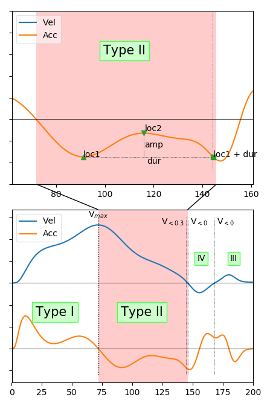

# Submovement Algorithm
## Library List
trajectory_2018_05_09.m

>parsing_data()
>
>>parsing_path()
>>
>>parsing_trial()
>>>func_started_stopped_filter()
>>>
>>>func_filtmat_class()
>>>
>>>func_kalman_filter()
>>>
>>>func_weighted_moving_avg()
>>>
>>>parsing_submovement()
>>>>func_elliott()

## Description
### trajectory_2018_05_09.m
To control which subjects, experimental distance, experimental conditions, and trials were needed to be calculated. 

This script would call the function  [**parsing_data()**](#parsing_data) with given arguments input :
>* *index of subject*
>* *index of distance*
>* *index of condition*
>* *filter mode*
>* *initial data path*

and get the following arguments output by the function  **parsing_data()** :
>* *Kinematic* :&nbsp;&nbsp;&nbsp;kinematic data
>* *Submoves* :&nbsp;&nbsp;&nbsp;information of submovement
>* *Counter* :&nbsp;&nbsp;&nbsp;&nbsp;&nbsp;&nbsp;number of submovement type
>* *Measures* :&nbsp;&nbsp;&nbsp;&nbsp;key position
>* *Amount* :&nbsp;&nbsp;&nbsp;&nbsp;&nbsp;&nbsp;number of submovement

### <a name="parsing_data">parsing_data()</a>
This script would call the function  [**parsing_path()**](#parsing_path) with given arguments input :
>* *data path*&nbsp;&nbsp;&nbsp;&nbsp;&nbsp;&nbsp;&nbsp;&nbsp;&nbsp;(via dialog choose)
>* *subject index*&nbsp;&nbsp;&nbsp;&nbsp;(via the input argument of parsing_data(), *index_sub*)
>* *distance index*&nbsp;&nbsp;(via the input argument of parsing_data(), *index_dist*)
>* *condition index* (via the input argument of parsing_data(), *index_cond*)

to get the following arguments output by the function  **parsing_path()** :
>* *subject folder*&nbsp;&nbsp;&nbsp;&nbsp;&nbsp;(void)
>* *distance folder*&nbsp;&nbsp;&nbsp;(void)
>* *condition folder* (**used**)

And also call the function  [**parsing_trial()**](#parsing_trial) with given arguments input :
>* *data*&nbsp;&nbsp;&nbsp;&nbsp;&nbsp;&nbsp;&nbsp;&nbsp;&nbsp;&nbsp;&nbsp;&nbsp;(via the variable within parsing_data(), *data*)
>* *filter mode* &nbsp;(via the input argument of parsing_data(), *filter*)

to get the following arguments output by the function  **parsing_trial()** :
>* *kinematic*
>* *peaks*
>* *typecounter*
>* *measures*

* **Parameter**
>
>*index_sub* 
>> the index of subject
>>> * type : integer / integer double
>
>*index_dist*
>> the index of distance
>>> * type : integer / integer double
>
>*index_cond*
>> the index of condition
>>> * type : integer / integer double
>
>*index_trial*
>> the index of trial. this argument could be:
>>> * 1 
>>> * [2, 10, 7, 41, 83]
>>> * 51:100
>>> * 'all' as 1:100
>>
>>> * type : integer / integer double / string
>
>*filter*
>> select the filter mode
>>> * 1 for low-pass filter
>>> * 2 for kalman filter
>>> * 3 for moving average
>>
>>> * type: integer
>
>*initial_path*
>> set the default data path
>>> * type: string
* **Return**
> *Kinematic*
>> kinematic data
>>> * structure: Kinematic{dist, cond}{trial, sub}
>>> 
>>>
>>> * type: cell
>
> *Submoves*
>> information of submovement
>>> * structure: Submoves{dist, cond}{trial, sub}
>>> 
>>>
>>> * type: cell
>
> *Counter*
>> count the number of submovement type in each context with experimental distance and contition
>>> * structure: Counter{sub, 1}{dist, cond}(trial, :)
>>> 
>>>
>>> * type: cell
>
> *Measures*
>> get the key position in each trial
>>> * structure: Measures{sub, 1}{dist, cond}(trial, :)
>>> 
>>>
>>> * type: cell
>
> *Amount*
>> count the number of submovement in each context with experimental distance and contition
>>> * structure: Amount{sub, 1}{dist, cond}(trial, :)
>>> 
>>>
>>> * type: cell
>
* **Pseudo Code**
> given that
>> subject: 1, 2, ..., 12
>>
>> distance: 10, 20, 30 cm
>>
>> condition: Fast, Fast-Mid, Middle, Mid-Accurate, Accurate
>>
>> parsing all trial
>>
>> with low-pass filter
```
index_sub    = 1:12;
index_dist   = 1:3;
index_cond   = 1:5;
index_trial  = 'all';
filter       = 1;
initial_path = 'E:\Data\exp1\12 subjects';

[Kinematic, Submoves, Counter, Measures, Amount] = parsing_data(...
    index_sub, index_dist, index_cond, index_trial, filter, initial_path);
```
> if we would like to get the Position of a submovement
>
> given that 
>> sub = 5, subjuct No.5, 
>>
>> dist = 3, distance in 30 cm,
>>
>> cond = 2, in the Fast-Middle movement speed
>>
>> trial = 7, assumed that submove was found at this trial 
```
Pos = Kinematic{3, 2}{8, 5}(:, 1); % Kinematic{dist, cond}{trial, sub}
peak = Submoves{3, 2}{8, 5};       % Submoves{dist, cond}{trial, sub}

% locations of all loc1
Pos(peak(:, 1))

% locations of all loc2
Pos(peak(:, 2))

% amplitudes of all submovement
peak(:, 3)

% durations of all submovement
peak(:, 4)
```
> if we would like to average the Counter in each experimental context, and concatenate this average with different subject
```
for sub = index_sub
    for dist = index_dist
        for cond = index_cond
            for trial = index_trial
                type_avg{dist, cond}(sub, :) = mean(Counter{sub, 1}{dist, cond});
            end
        end
    end
end
```
### <a name="parsing_path">parsing_path()</a>
According to the data saving folder to build the structured path for running the script.
* **Parameter**
> *path_data*
>> 'path_data\\'
>
> *subj*
>> *path_sub* = 'path_data\\Ssubj\\'
>
> *dist*
>> *path_dist* = 'path_data\\Ssubj\\dist\\'
>
> *cond*
>> *path_cond* = 'path_data\\Ssubj\\dist\\cond'
* **Return**
> *path_sub*
>
> *path_dist*
>
> *path_cond*
* **Pseudo Code**
```
>> path_sub = parsing_path('D:\Data\exp1\12 subject', 1, 20, 3)

path_sub =

    'D:\Data\exp1\12 subject\S1'


>> [~, ~, path_cond] = parsing_path('D:\Data\exp1\12 subject', 1, 20, 3)

path_cond = 

    'D:\Data\exp1\12 subject\S1\20\3'
```
### <a name="parsing_trial">parsing_trial()</a>
This script would call the function  [**func_started_stopped_filter()**](#func_start_stop) with given arguments input :
>* *pos* : position data (unit: cm)

and get the following arguments output:
>* *start* :&nbsp;&nbsp;&nbsp;index of started point
>* *stop* :&nbsp;&nbsp;&nbsp;index of stopped point

Call [**func_filtmat_class()**](#func_butterworth) to smooth data. Given arguments input :

>* *dt* &nbsp;&nbsp;&nbsp;&nbsp;&nbsp;&nbsp;: 1/130  sec
>* *cutoff* : 5 Hz
>* *data* &nbsp;&nbsp;: position data, the same as the argument in **func_started_stopped_filter()** used.
>* *ftype* &nbsp;: 1, low-pass
>* *forder* : 2

and get the filtered position data as arguments output : 
>* *fdata* : the filtered input data

Then calling [**parsing_submovenemt()**](#parsing_submovement) with given arguments input:
>* *Vel*: (unit: cm/s)
>* *Acc*: (unit: cm/s<sup>2</sup>)

to get the profile of submovement in trial:
>* *peak*
>* *typecounter*

* **Parameter**
> *data*
>> raw data
>>
>> unit: pixel
>>
>> sample rate: 130Hz
>
> *filter* 
>> 1. for [Butterworth filter](#func_butterworth) 
>> 2. for [Kalman filter](#kalman_filter)
>> 3. for [moving average](#moving_average)
* **Return**
> *kinematic*
>> [ *Pos* , *Vel* , *Acc* , *Jerk* ] in trial
>
> *peaks*
>> concatenate profile of submovement
>>
>> [loc1, loc2, amp, dur, type]
>>
>> see also [**parsing_submovement()**](#parsing_submovement)
>
> *typecounter*
>> see also [**parsing_submovement()**](#parsing_submovement)
>
> *measures*
>> [ *Acc*<sub>max</sub> , *Vel*<sub>max</sub> , *Acc*<sub>negative peak</sub> , *Pos*<sub>end</sub> ] in trial

### <a name="func_start_stop">func_started_stopped_filter()</a>
For simplifying data slice, or we had to the Square.sum file to find the data row which corresponding to the trial. 
* **Parameter**
> *pos*
>> position data (unit: cm)
>>
>> currently transformed constant: **0.00201** cm/pixel
>>
>> where the unit of the raw was pixel 

* **Return**
> *start*
>> the index of started point
>
> *stop*
>> the index of stopped point

* **Description**
> using of the position data to calculate the velocity (difference of position * sample rate). where the sample rate was **130** Hertz.
>
> start
>> continuously cumulative 4 points (duration >= 30ms) velocity >= 0.3 cm/s, get the 1<sup>st</sup> point velocity >= 0.3 as the started point
>>
>> example:
>>```
>>  ind:     1,    2,    3,    4,    5,    6, ...
>>  vel:  0.25, 0.31, 0.47, 0.69, 0.82, 1.21, ...
>> >0.3: False, True, True, True, True, True, ...
>>```
>> the velocity of the index 2, 3, 4, 5, ... were greater than 0.3 cm/s. so the started point was 2.
>
> stop
>> continuously cumulative 4 points (duration >= 30ms) absolute velocity <= 0.3 cm/s, get the 1<sup>st</sup> point abs(velocity) <= 0.3 as the stopped point
>> example:
>>```
>>  ind:    82,   83,   84,   85,   86,   87, ...
>>  vel:  0.33, 0.29, 0.29, 0.27, 0.19, 0.11, ...
>> <0.3: False, True, True, True, True, True, ...
>>```
>> the velocity of the index 83, 84, 85, 86, ... were less than 0.3 cm/s. so the stopped point was 83.
### <a name="func_butterworth">func_filtmat_class()</a>
Use of the butterworth filter design to build a low-pass filter
* **Parameter**
> *dt*
>> interval between samples  (units - seconds)
>
> *cutoff*
>> required cut-off frequency/ies  (units - Hertz)
>
> *data*
>> the matrix containing the data, assumes individual data sets are in columns.
>
> *ftype*
>> specifies the filter type  [optional, default = 1]
>>> * 1 for low-pass filter
>>> * 2 for high-pass
>>> * 3 for band-pass
>
> *forder*
>> order of filter  [optional, default = 2]
* **Return**
> *fdata*
>> the filtered input data

### <a name="kalman_filter">func_kalman_filter()</a>
See also [Kalman Filter](https://en.wikipedia.org/wiki/Kalman_filter) via wikipedia.
* **Parameter**
> *data*
>> the matrix containing the data, assumes individual data sets are in columns.
>
> *Q*
>> the covariance of the process noise
>
> *R*
>> the covariance of the observation noise
* **Return**
> *fdata*
>> the filtered input data

### <a name="moving_average">func_weighted_moving_avg()</a>
*pending*

### <a name="parsing_submovement">parsing_submovement()</a>
This script would call the function  [**func_elliott()**](#func_elliott) with given arguments input :
>* *x*&nbsp;&nbsp;&nbsp;&nbsp;&nbsp;&nbsp;&nbsp;&nbsp;&nbsp;: kinematic series, *Acc* (Type I & II) or *Vel* (Type III & IV)
>* *initial*&nbsp;&nbsp;: the beginning point during the kinematic series
>* *final*&nbsp;&nbsp;&nbsp;&nbsp;: the end point during the kinematic series
>* *type*&nbsp;&nbsp;&nbsp;&nbsp;:  
>>using of V<sub>max</sub> , V<sub><0.3</sub> , V<sub><0</sub> , to define the direction, boundary (*initial* & *final*) and type see **Operation Flow**

to get the following arguments output by the function **func_elliott()** :
>* *peak*&nbsp;&nbsp;&nbsp;&nbsp;: [loc1, loc2, amp, dur, type]
<a name="peak_arg">
<table>
  <thead>
        <tr>
            <th>Argument</th>
            <th>Type I & II</th>
            <th>Type III & IV</th>
        </tr>
    </thead>
    <tbody>
        <tr>
            <th>loc1</th>
            <td>1<sup>st</sup> reversal point</td>
            <td>initial point</td>
        </tr>
    </tbody>
    <tbody>
        <tr>
            <th>loc2</th>
            <td>2<sup>nd</sup> reversal point</td>
            <td>final point</td>
        </tr>
    </tbody>
    <tbody>
        <tr>
            <th>amp</th>
            <td>|Acc(loc2) - Acc(loc2)|</td>
            <td>local maximum or minimum</td>
        </tr>
    </tbody>
    <tbody>
        <tr>
            <th>dur</th>
            <td>
            <p>|Acc(loc1 + dur)| > |Acc(loc1)|</p>
            <p>3<sup>rd</sup> reversal point to 1<sup>st</sup></p>
            </td>
            <td>final - initial</td>
        </tr>
    </tbody>
</table>
</a>

* <a name="operation_flow">**Operation Flow**</a>


<table>
    <thead>
        <tr>
            <th>Type</th>
            <td>Name</td>
            <td>Description</td>
            <td>Parameter</td>
        </tr>
    </thead>
    <tbody>
        <tr>
            <th>I</th>
            <td>pre-peak</td>
            <td>overlapping on positive acceleration</td>
            <td>1</td>
        </tr>
    </tbody>
    <tbody>
        <tr>
            <th>II</th>
            <td>post-peak</td>
            <td>overlapping on negative acceleration</td>
            <td>2</td>
        </tr>
    </tbody>
    <tbody>
        <tr>
            <th>III</th>
            <td>under-shoot</td>
            <td>after vel* less than 0.3 then greater than 5 </td>
            <td>3</td>
        </tr>
    </tbody>
    <tbody>
        <tr>
            <th>IV</th>
            <td>over-shoot</td>
            <td>after vel zero-crossing then less than -1 </td>
            <td>4</td>
        </tr>
    </tbody>
</table>
* vel unit: cm/s 

* **Parameter**
> *Vel*
>> velocity, unit cm/s
>
> *Acc*
>> acceleration, unit cm/s<sup>2</sup>

* **Return**
> *peaks*
>> concatenate all peaks during trial, such as:
>>
>> [ peak1;
>>
>>&nbsp;&nbsp;peak2;
>>
>>&nbsp;&nbsp;peak2;
>>
>>&nbsp;&nbsp;peak3]
>>
>> where the peak was [loc1, loc2, amp, dur, type]
>>
> *typecounter*
>> [None, I, II, III, IV] which types of peaks were detected.
>>
>> example:
>>> 1 *Type I* & 3 *Type II* were found
>>>
>>> return [0, 1, 1, 0, 0]
>>
>> example:
>>> *over-shooting* & *under-shooting* were found
>>>
>>> return [0, 0, 0, 1, 1]
>>
>> example:
>>> submovement were not found
>>>
>>> return [1, 0, 0, 0, 0]
* **Pseudo Code**
```
>> [peaks, typecounter] = parsing_submovement(Vel, Acc)

peaks =

    20  10  40  20   1
    
    80  90  35  19   2
    
typecounter = 

     0   1   1   0   0
```
### <a name="func_elliott">func_elliott()</a>

* <a name="func_elliott_arg">**Parameter**</a>
> *x*
>> kinematic series
>>
>> *Acc* for Type I & II
>>
>> *Vel* for Type III & IV
>
> *initial*
>> the beginning point during the kinematic series
>>
>> Type I : from 1<sup>st</sup> data point
>>
>> Type II : from V<sub>max</sub> location 
>>
>> Type III: from V<sub><0.3</sub> 
>>
>> Type IV: from 1<sup>st</sup> V<sub><0</sub> 
>
> *final*
>> the end point during the kinematic series
>>
>> Type I : to V<sub>max</sub> location
>>
>> Type II : to 
>>> **V<sub><0.3</sub> location** or **the last data point** for V<sub>zero-crossing</sub> not found
>>>
>>> **V<sub><0.3</sub>** for 1 V<sub>zero-crossing</sub> was found
>>>
>>> **1<sup>st</sup> V<sub><0</sub>** for 2 V<sub>zero-crossing</sub> were found
>>
>> Type III: to 
>>> **the last data point** for V<sub>zero-crossing</sub> not found
>>>
>>> **1<sup>st</sup> V<sub><0</sub>** for 1 V<sub>zero-crossing</sub> was found
>>
>> Type IV: to 
>>> **the last data point** for 1 V<sub>zero-crossing</sub> was found
>>>
>>> **2<sup>nd</sup> V<sub><0</sub>** for 2 V<sub>zero-crossing</sub> were found>
>> 
>>
>> fig.1. the boundary of types
>
> *type*
>> using of V<sub>max</sub> , V<sub><0.3</sub> , V<sub><0</sub> , to define the direction, boundary and type (fig.1.). recall [**Operation Flow**](#operation_flow)

* **Return**
> *peak*&nbsp;&nbsp;&nbsp;&nbsp;: [loc1, loc2, amp, dur, type]

* **Definition**

> Given the data,boundaries and type [parameters](#func_elliott_arg). To detect the arguments of [peak](#peak_arg)
>
> Type I
>> direction: V<sub>max</sub> to 1<sup>st</sup> data point
>>
>> loc1: the location of the 1<sup>st</sup> reversal point
>>
>> loc2: 
>>> the location of the 2<sup>nd</sup> reversal point
>>>
>>> if the 2<sup>nd</sup> reversal point was not found, let the final boundary as loc2 
>>
>> amp:
>>> the difference between the value at loc1 & loc2
>>>
>>> amp >= 10% Acc<sub>max</sub>
>>
>> dur: 
>>> along the direction, to find the point which value >= the value of loc1
>>>
>>> if that point was not found, let the 3<sup>rd</sup> reversal point to loc1 as dur
>>>
>>> and if that point was still not found, let the final boundary to loc1 as dur
>>>
>>> dur >= 72 ms
>> 
> Type II
>> direction: V<sub>max</sub> to V<sub><0.3</sub> or V<sub><0</sub>
>>
>> loc1: the location of the 1<sup>st</sup> reversal point
>>
>> loc2: 
>>> the location of the 2<sup>nd</sup> reversal point
>>>
>>> if the 2<sup>nd</sup> reversal point was not found, let the final boundary as loc2 
>>
>> amp:
>>> the difference between the value at loc1 & loc2
>>>
>>> amp >= 10% Acc<sub>max</sub>
>>
>> dur: 
>>> along the direction, to find the point which value <= the value of loc1
>>>
>>> if that point was not found, let the 3<sup>rd</sup> reversal point to loc1 as dur
>>>
>>> and if that point was not found, let the final boundary to loc1 as dur
>>>
>>> dur >= 72 ms
>> 
> Type III
>>direction: V<sub><0.3</sub> to the last data point
>>
>> loc1: the initial point of the boundary
>>> 0 zero-crossing: V<sub><0.3</sub> to the last data point
>>>
>>> 1 zero-crossing: V<sub><0.3</sub> to V<sub><0</sub>
>>>
>>> 2 zero-crossing: 2nd V<sub><0</sub> to the last data point
>>>
>>> recall [Operation Flow](#operation_flow)
>>
>> loc2:
>>> the location of the maximum velocity during the boundary
>>
>> amp:
>>> the maximum velocity during the boundary
>>>
>>> amp >= 5 cm/s
>>
>> dur:
>>> time during the boundary
>> 
> Type IV
>> direction: V<0 to the last data point or 1st V<sub><0</sub> to 2<sup>nd</sup> V<sub><0</sub>
>>
>> loc1: the initial point of the boundary
>>> 1 zero-crossing: V<sub><0</sub> to the last data point
>>>
>>> 2 zero-crossing: 1<sup>st</sup> V<sub><0</sub> to 2<sup>nd</sup> V<sub><0</sub>
>>>
>>> recall [Operation Flow](#operation_flow)
>>
>> loc2:
>>> the location of the minimum velocity during the boundary
>>
>> amp:
>>> the minimum velocity during the boundary
>>>
>>> amp <= -1 cm/s
>>
>>dur:
>>>time during the boundary
>> 

## Compared with the previous version 
the old version was elliott0102.m created on 2018-01-02.
> method:
>> paired-sample *t*-test
>>
>> alternative hypothesis: both tail
>>
>> significance level: *p* < .05

> 
>
>> type average

>
>
>> amount average
